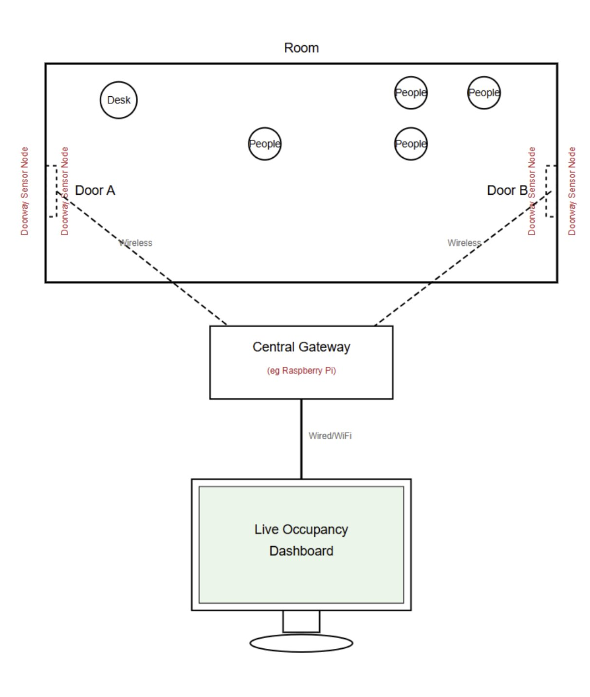
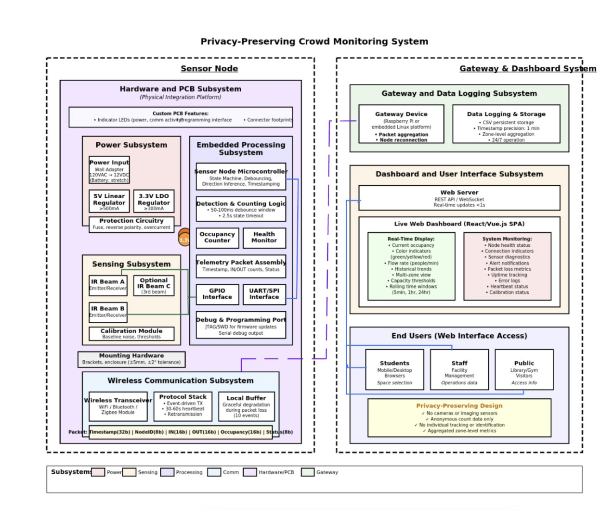
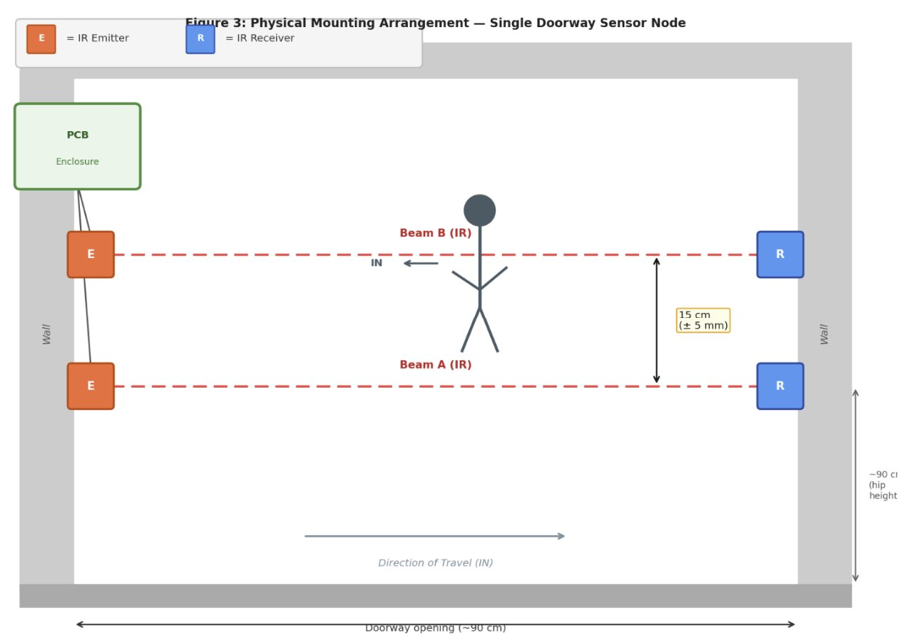
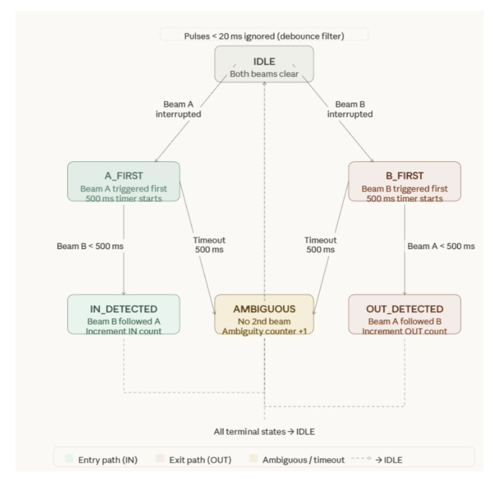
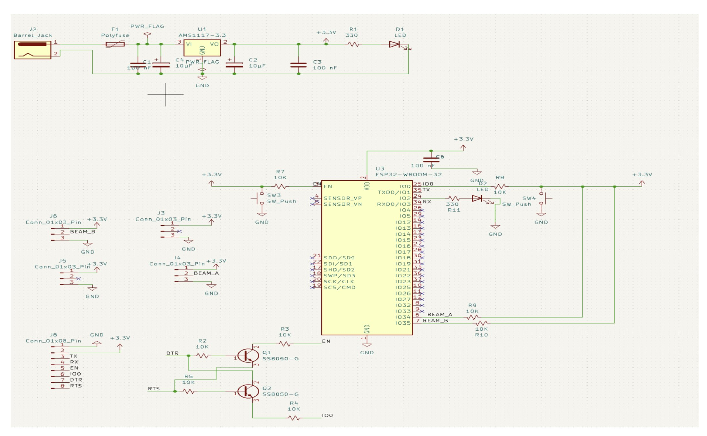
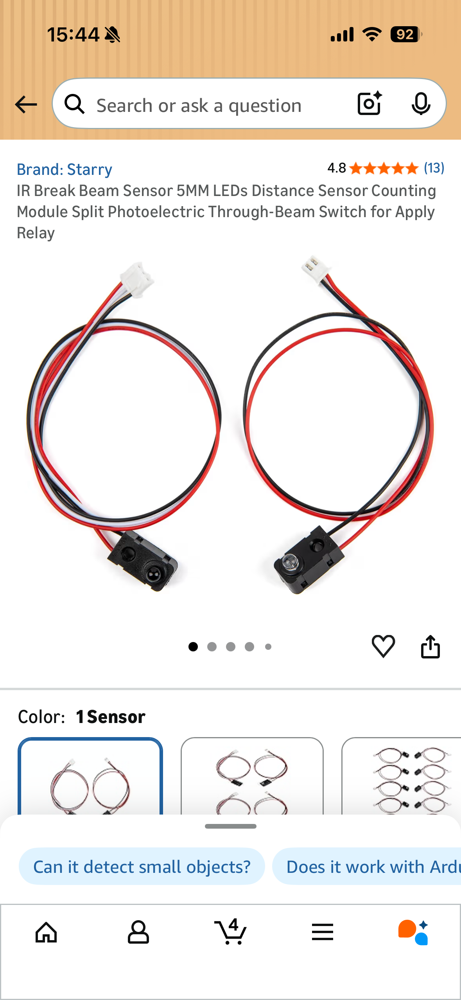
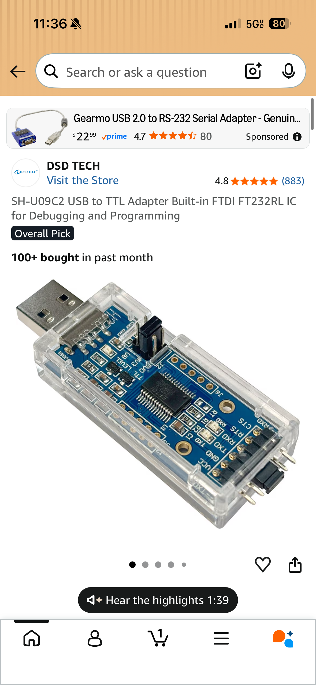
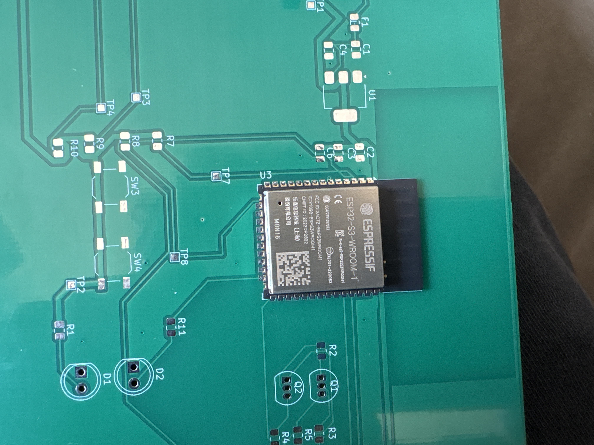
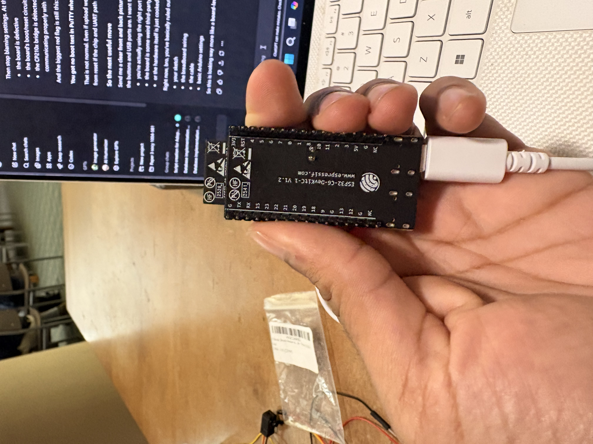
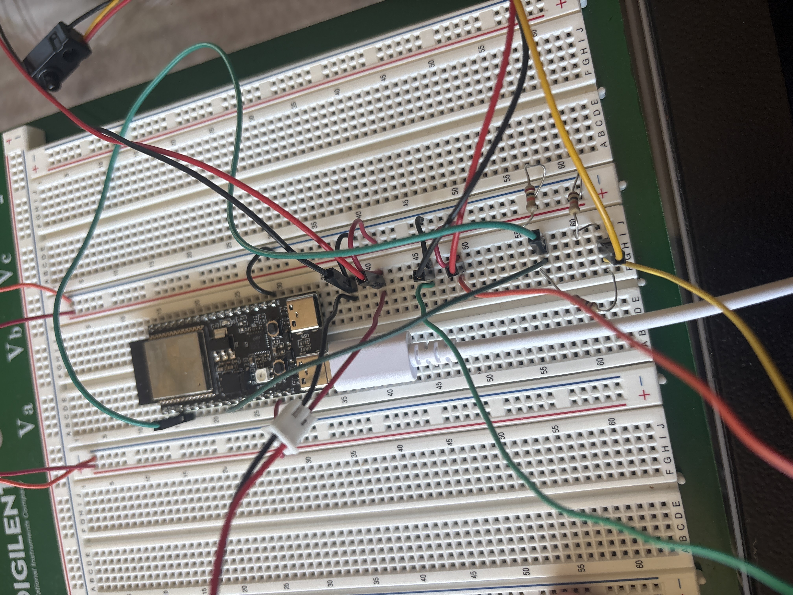

# ECE 445 Lab Notebook — Johnathan Abraham
**Team #50 — CrowdSurf: Privacy-Preserving Crowd Monitoring System**
**Contact:** jabra6@illinois.edu | (708) 971-4108
**Role:** Hardware/PCB Lead & Dashboard Subsystem

---

## Table of Contents

1. [2025-02-10 — Project Proposal & System Architecture](#entry-1)
2. [2025-02-20 — KiCad Schematic Capture](#entry-2)
3. [2025-03-05 — PCB Layout, DRC, and Fabrication](#entry-3)
4. [2025-03-18 — Component Sourcing & BOM](#entry-4)
5. [2025-03-28 — PCB Assembly & Soldering](#entry-5)
6. [2025-04-02 — Prototype FSM Validation on Dev Board](#entry-6)
7. [2025-04-08 — MQTT Broker Setup on Raspberry Pi](#entry-7)
8. [2025-04-15 — React Dashboard & useMqtt Hook Integration](#entry-8)
9. [2025-04-20 — End-to-End Pipeline Verification](#entry-9)
10. [2025-04-25 — Mock Presentation Review & Final Prep](#entry-10)

---

---

## Entry 1 — Project Proposal & System Architecture <a name="entry-1"></a>

**Date:** 2025-02-10
**Objectives:** Define system concept, assign subsystem ownership, establish quantified requirements, and submit ECE 445 project proposal.

### Problem Statement

Venues such as libraries, gyms, and classrooms frequently exceed safe occupancy limits with no automated enforcement or awareness mechanism. Existing solutions rely on cameras or RFID — both expensive and privacy-invasive. CrowdSurf provides real-time occupancy monitoring using only anonymous IR beam-break counting: no cameras, no identity tracking.

### System Architecture

The system is structured around two major subsystems: a Sensor Node (PCB + ESP32 + IR sensors) and a Gateway/Dashboard system (Raspberry Pi + React frontend).

**Figure 1.1 — High-Level System Block Diagram**



Each doorway is fitted with a Sensor Node that transmits occupancy events wirelessly to the Central Gateway (Raspberry Pi), which forwards live data to the browser-based dashboard.

**Figure 1.2 — Detailed Subsystem Block Diagram**



Key subsystems within the Sensor Node:
- **Power:** Barrel jack → 5V linear reg → 3.3V LDO (AMS1117-3.3, ≥300mA)
- **Sensing:** Dual IR beam pairs (Beam A, Beam B), calibration module
- **Processing:** ESP32 microcontroller running FSM with debouncing and direction inference
- **Communication:** WiFi/MQTT, event-driven TX, local buffer (10 events) for graceful degradation

### Team Subsystem Ownership

| Subsystem | Owner |
|---|---|
| Hardware/PCB | Johnathan Abraham |
| Gateway / Data Logging | Tanvika Boyineni |
| ESP32 Firmware / FSM | Ananya Krishnan |
| React Dashboard | Johnathan Abraham |

### Quantified Requirements (R&V Table Summary)

| Requirement | Target | Verification Method |
|---|---|---|
| Detection Accuracy | ≥ 90% | 30 controlled entry/exit trials |
| End-to-end Latency | ≤ 3000 ms | Timestamp delta: sensor break → dashboard update |
| Continuous Reliability | ≥ 1 hour | Uninterrupted operation soak test |

### Physical Sensor Mounting

**Figure 1.3 — Single Doorway Sensor Node Physical Mounting Arrangement**



Two IR beams (Beam A, Beam B) are mounted horizontally across the doorway at approximately hip height (~90 cm). Beam spacing is 15 cm (±5 mm). The PCB enclosure mounts flush to the wall on one side; emitters (E) face receivers (R) directly across the ~90 cm doorway opening. Direction of travel is inferred by which beam is broken first.

### FSM Design

**Figure 1.4 — FSM State Diagram**



States: IDLE → A_FIRST or B_FIRST → IN_DETECTED / OUT_DETECTED / AMBIGUOUS

- Pulses shorter than 20 ms are filtered (debounce)
- 500 ms timer starts on first beam interruption
- A_FIRST → Beam B within 500 ms = **IN_DETECTED**, increment IN count
- B_FIRST → Beam A within 500 ms = **OUT_DETECTED**, increment OUT count
- Either state → no 2nd beam within 500 ms = **AMBIGUOUS**, increment ambiguity counter
- All terminal states return to IDLE

### Design Decision Log

- **IR beam-break over PIR/ultrasonic:** Deterministic trigger, no false positives from ambient heat, sufficient precision for narrow doorway.
- **MQTT over HTTP polling:** Pub/sub decouples firmware from dashboard; lower latency; Mosquitto is lightweight for Pi.
- **ESP32-WROOM-32 on PCB:** Onboard WiFi, sufficient GPIO for dual IR pairs, well-supported IDF toolchain.
- **S3 dev board for prototyping:** Used ESP32-S3 DevKit for early FSM firmware validation before custom PCB was fabricated (compatible pinout, same IDF toolchain).

### Bibliographic References

1. Espressif Systems. *ESP32-WROOM-32 Datasheet*, v3.2. https://www.espressif.com/sites/default/files/documentation/esp32-wroom-32_datasheet_en.pdf
2. Texas Instruments / AMS. *AMS1117 LDO Regulator Datasheet*. https://www.ti.com/lit/ds/symlink/lm1117.pdf
3. Starry. *IR Break Beam Sensor 5MM LEDs — Split Photoelectric Through-Beam Switch*. Amazon ASIN sourced (see Entry 4).
4. Eclipse Foundation. *Mosquitto MQTT Broker Documentation*. https://mosquitto.org/documentation/
5. React. *Hooks Reference — useEffect, useState*. https://react.dev/reference/react

---

---

## Entry 2 — KiCad Schematic Capture <a name="entry-2"></a>

**Date:** 2025-02-20
**Objectives:** Complete full schematic in KiCad. Capture all subsystems: power regulation, ESP32 module, IR sensor connectors, auto-reset circuit, debug header. Pass ERC with zero errors.

### Schematic Overview

**Figure 2.1 — Full KiCad Schematic**



Key nets and blocks visible in schematic:

**Power Rail:**
- J2 (Barrel Jack) → F1 (Polyfuse, 500mA) → U1 (AMS1117-3.3) → +3.3V rail
- Bulk decoupling: C1 (100nF), C4 (10µF) at LDO input; C2 (10µF), C3 (100nF) at output
- C6 (100nF) local decoupling at ESP32 VCC pin

**ESP32 (U3 — ESP32-WROOM-32):**
- IO6 → BEAM_A signal; IO7 → BEAM_B signal
- EN pin pulled up via R7 (10kΩ) with SW3 (manual reset pushbutton)
- IO0 pulled up via R3 (10kΩ), controlled by auto-reset circuit

**IR Sensor Connectors:**
- J3, J4 (BEAM_A pair — emitter + receiver headers, 3-pin: +3.3V, signal, GND)
- J5, J6 (BEAM_B pair — same pinout)
- Pull-up resistors R9, R10 (10kΩ each) on BEAM_A and BEAM_B signal lines

**Auto-Reset Circuit (Q1, Q2 — SS8050-G NPN):**
- Q1: DTR signal → base (R2 = 10kΩ) → collector drives ESP32 EN
- Q2: RTS signal → base (R5 = 10kΩ) → collector drives ESP32 IO0
- R4 (10kΩ): IO0 to GND pull-down

Standard DTR/RTS two-transistor circuit enabling automatic bootloader entry during flashing without manual button press.

**Debug Header (J8 — 8-pin):**
- Exposes: GND, +3.3V, TX, RX, EN, IO0, DTR, RTS

**Status LEDs:**
- D1: Power indicator (R1 = 330Ω, on +3.3V rail)
- D2: Comms activity indicator (R11 = 330Ω, driven by GPIO)

### IR Sensor Pull-up Resistor Calculation

Sensor output is open-collector (active low when beam broken). Pull-up to 3.3V:

```
V_high = 3.3V
I_pull = V_high / R_pull = 3.3V / 10,000Ω = 0.33 mA
```

0.33 mA is within ESP32 GPIO input leakage spec (<1 mA). 10kΩ chosen as standard pull-up value — low enough to overcome leakage, high enough not to waste power.

### ERC Results

Initial ERC violations and resolutions:

| Violation | Resolution |
|---|---|
| "Pin unconnected" on unused ESP32 GPIOs | Added no-connect markers (X) on all unused IO pins |
| "Power pin unconnected" on VBUS net | Tied to correct net label; added PWR_FLAG symbol |

**Final ERC: 0 errors, 0 warnings.**

### Footprint Assignments

| Reference | Component | Footprint |
|---|---|---|
| U1 | AMS1117-3.3 | SOT-223-3 |
| U3 | ESP32-WROOM-32 | ESP32-WROOM-32 (38-pad LGA) |
| F1 | Polyfuse 500mA | Fuse_1206_3216Metric |
| Q1, Q2 | SS8050-G NPN | SOT-23 |
| C1–C4, C6 | 100nF / 10µF caps | C_0402 / C_0805 |
| R1–R11 | Various resistors | R_0402 |
| D1, D2 | LEDs | LED_D3.0mm (through-hole) |
| J3–J6 | IR sensor headers | PinHeader_1x03_P2.54mm |
| J8 | Debug header | PinHeader_1x08_P2.54mm |
| SW3, SW4 | Pushbuttons | SW_Push_6mm |

---

---

## Entry 3 — PCB Layout, DRC, and Fabrication <a name="entry-3"></a>

**Date:** 2025-03-05
**Objectives:** Complete 2-layer PCB layout in KiCad. Place all components, route all traces, add copper pours, run DRC, resolve all violations, and submit Gerbers to fab.

### Layout Decisions

- 2-layer board: signal routing on F.Cu, GND pour on B.Cu
- ESP32 antenna region: keep-out zone placed per Espressif hardware design guidelines (no copper beneath module antenna)
- GND via stitching every ~10mm along board perimeter to minimize ground impedance
- IR sensor headers (J3–J6) placed at board edge for external sensor cable routing

### Power Trace Width Calculation

Per IPC-2221, for 500mA on outer layer, 1oz copper, ΔT = 10°C:

```
W_min ≈ 0.5mm (from chart)
W_used = 0.8mm (30% margin)
```

All power traces (5V input, 3.3V rail) routed at 0.8mm. Signal traces at 0.25mm.

### DRC Violations Encountered and Resolved

| Issue | Root Cause | Resolution |
|---|---|---|
| GND pour fragmentation (isolated copper islands) | Component placement narrowed pour neck, breaking continuity | Relocated two bypass caps; re-ran pour fill |
| Trace through ESP32 antenna keep-out zone | Auto-router violation | Deleted and manually re-routed around keep-out (+3mm trace length) |
| Power trace width < minimum | Default 0.25mm trace on 5V net | Widened to 0.8mm per IPC-2221 |

**Final DRC: 0 errors, 0 warnings.**

### Gerber Export

Exported layers: F.Cu, B.Cu, F.SilkS, B.SilkS, F.Mask, B.Mask, Edge.Cuts + drill file (.drl). Submitted to fabrication vendor. Estimated turnaround: ~10 days.

---

---

## Entry 4 — Component Sourcing & BOM <a name="entry-4"></a>

**Date:** 2025-03-18
**Objectives:** Source all BOM components. Verify availability and footprint compatibility. Stage parts for assembly.

### IR Sensor Selection

**Figure 4.1 — IR Break Beam Sensor (sourced via Amazon)**



Selected: Starry IR Break Beam Sensor, 5MM LED, split photoelectric through-beam switch. Chosen for:
- Separated emitter/receiver housing (beam-break, not reflective — eliminates false positives from surface reflections)
- 5V compatible (operates on 3.3V supply with adjusted current resistor)
- JST connector with pre-wired leads (simplifies PCB connector interface)

### USB-to-TTL Debug Adapter

**Figure 4.2 — DSD TECH SH-U09C2 USB-to-TTL Adapter (FTDI FT232RL)**



Sourced for serial debug monitoring during firmware bring-up. FTDI FT232RL chosen over CH340 clones for driver reliability on Windows. Used to monitor UART TX output from ESP32 when debugging FSM state transitions and MQTT publish calls before auto-reset circuit was confirmed functional.

### Full BOM

| Reference | Component | Vendor | Qty | Notes |
|---|---|---|---|---|
| U3 | ESP32-WROOM-32 module | Mouser | 2 | +1 spare |
| U1 | AMS1117-3.3 LDO | Digikey | 5 | SOT-223 |
| J3–J6 | IR Break Beam sensors | Amazon | 4 pairs | Starry brand, pre-wired JST |
| Q1, Q2 | SS8050-G NPN | Digikey | 10 | SOT-23 |
| F1 | Polyfuse 500mA | Adafruit | 5 | 1206 package |
| R1, R11 | 330Ω (0402) | Digikey | 20 | LED current limit |
| R2–R5, R7, R8 | 10kΩ (0402) | Digikey | 50 | Pull-ups, auto-reset |
| R9, R10 | 10kΩ (0402) | Digikey | 20 | Sensor signal pull-ups |
| C1, C3, C6 | 100nF (0402) | Digikey | 50 | Decoupling |
| C2, C4 | 10µF (0805) | Digikey | 20 | Bulk decoupling |
| D1, D2 | 3mm LED | Adafruit | 10 | Red/green |
| SW3, SW4 | 6mm pushbutton | Digikey | 10 | Reset / boot |
| J2 | Barrel jack 5.5/2.1mm | Digikey | 5 | Power input |
| J8 | 8-pin male header | Amazon | 20 | Debug interface |

---

---

## Entry 5 — PCB Assembly & Soldering <a name="entry-5"></a>

**Date:** 2025-03-28
**Objectives:** Hand-solder all SMD components. Inspect all joints. Confirm no bridges or cold joints.

### Assembly Sequence

1. 0402 passives (R, C) — hot air reflow, tweezers placement
2. SOT-223 AMS1117-3.3 (U1) — hot air reflow
3. SOT-23 NPN transistors Q1, Q2 — hot air reflow
4. 1206 Polyfuse F1 — hot air reflow
5. ESP32-WROOM-32 module (U3) — hot air with flux paste; loupe inspection of all pads
6. Through-hole: LEDs D1/D2, pushbuttons SW3/SW4, barrel jack J2, headers J3–J6, J8 — iron

**Figure 5.1 — ESP32-S3 Module Physical Fitment Check on Bare PCB**

*(Note: S3-WROOM-1 module used only for footprint fitment verification prior to assembling with WROOM-32. The S3 module shares the same 38-pad LGA footprint — this confirmed pad alignment before committing the WROOM-32 module.)*



### Assembly Issues Encountered

| Issue | Detection | Resolution |
|---|---|---|
| NPN Q2 placed 180° rotated | Loupe — pin 1 mark misaligned vs silkscreen | Desoldered with hot air + wick; re-placed correctly |
| Polyfuse F1 tombstoning (one end lifted) | Visual during reflow | Re-applied heat to lifted end; pressed flat with tweezers while cooling |

### Post-Assembly Inspection

- All joints inspected under loupe
- No solder bridges observed on ESP32 module pad row
- Continuity: GND ring around board — pass
- Power-on not performed this session (firmware not ready)

---

---

## Entry 6 — Prototype FSM Validation on Dev Board <a name="entry-6"></a>

**Date:** 2025-04-02
**Objectives:** Validate FSM firmware on ESP32 dev board with physical IR sensors wired to breadboard. Confirm 20/20 accuracy on controlled trials before committing to custom PCB bring-up.

### Dev Board Used

**Figure 6.1 — ESP32-C6-DevKitC-1 V1.2 (Espressif)**



ESP32-C6-DevKitC-1 used for firmware development. Note: the PCB uses ESP32-WROOM-32; the C6 DevKit was available in lab and shares compatible GPIO behavior and the ESP-IDF toolchain. The S3-WROOM-1 was used for initial fitment testing (Entry 5); the C6 DevKit was used for firmware because it was the board on hand during firmware development sessions.

### Breadboard Test Setup

**Figure 6.2 — Breadboard Wiring: ESP32 Dev Board + IR Sensors + Pull-up Resistors**



Wiring:
- IR sensor signal lines → GPIO pins on dev board with 10kΩ pull-ups to 3.3V
- USB-C → laptop for power and UART monitoring
- FTDI adapter connected for secondary serial monitoring (see Entry 4, Fig 4.2)

### Flash Procedure

```bash
idf.py -p /dev/ttyUSB0 flash monitor
```

Initial failure:
```
A fatal error occurred: Failed to connect to ESP32-C6: Timed out waiting for packet header
```

**Root cause:** CP2102 USB-serial bridge driver not loaded.
**Resolution:** Installed Silicon Labs CP210x driver; device enumerated correctly on retry.

### FSM Validation Results

Ran 20 controlled trials with physical beam interruptions:

| Trial Type | Count | Correct | Notes |
|---|---|---|---|
| Entry (A then B) | 10 | 10 | All correctly classified IN |
| Exit (B then A) | 10 | 10 | All correctly classified OUT |
| **Total** | **20** | **20** | **100% accuracy** |

Serial monitor confirmed correct state transitions and MQTT payload format on each trial.

### MQTT Payload Format Confirmed

```json
{
  "zone": "z-test",
  "count": 3,
  "last_event": "IN",
  "timestamp": 1712000000
}
```

Published to topic: `crowdsurf/zones/z-test/count`

---

---

## Entry 7 — MQTT Broker Setup on Raspberry Pi <a name="entry-7"></a>

**Date:** 2025-04-08
**Objectives:** Install Mosquitto on Raspberry Pi. Enable WebSocket listener on port 9001. Confirm ESP32 can publish and dashboard can subscribe.

### Mosquitto Installation

```bash
sudo apt update && sudo apt install mosquitto mosquitto-clients -y
sudo systemctl enable mosquitto && sudo systemctl start mosquitto
```

### WebSocket Configuration

`/etc/mosquitto/mosquitto.conf`:

```
listener 1883
protocol mqtt

listener 9001
protocol websockets
allow_anonymous true
```

### Network Issue — IllinoisNet Firewall

IllinoisNet blocks inter-device MQTT traffic between student devices. Port 1883 connections from ESP32 to Pi were dropped.

**Workaround:** Personal hotspot ("Johnathan Abraham") on phone. All devices (Pi, ESP32, laptop) connected to same hotspot subnet.

- Pi IP: **172.20.10.5**
- MQTT accessible at `172.20.10.5:1883` (firmware) and `172.20.10.5:9001` (dashboard WebSocket)

**Verification:** `mosquitto_pub` from laptop → `mosquitto_sub` on Pi — messages received. ESP32 connects and publishes successfully on hotspot network.

---

---

## Entry 8 — React Dashboard & useMqtt Hook Integration <a name="entry-8"></a>

**Date:** 2025-04-15
**Objectives:** Migrate dashboard from simulated data to live MQTT WebSocket subscription. Implement `useMqtt.ts` custom hook. Measure UI update latency.

### useMqtt Hook Implementation

```typescript
// useMqtt.ts
import { useEffect, useState } from 'react';
import mqtt from 'mqtt';

export function useMqtt(brokerUrl: string, topic: string) {
  const [message, setMessage] = useState<string | null>(null);
  const [connected, setConnected] = useState(false);

  useEffect(() => {
    const client = mqtt.connect(brokerUrl);
    client.on('connect', () => {
      setConnected(true);
      client.subscribe(topic);
    });
    client.on('message', (_topic, payload) => {
      setMessage(payload.toString());
    });
    return () => { client.end(); };
  }, [brokerUrl, topic]);

  return { message, connected };
}
```

Broker: `ws://172.20.10.5:9001` | Topic: `crowdsurf/zones/z-test/count`

### Dashboard Features

- Live occupancy count (large numeric display)
- Color-coded status: green (<80% capacity), yellow (80–99%), red (≥100%)
- MQTT connection badge (MQTT LIVE / DISCONNECTED)
- Event log: last 10 entry/exit events with timestamps

### End-to-End Latency Measurement

Measured from physical beam interruption to visible dashboard update:

| Trial | Latency (ms) |
|---|---|
| 1 | 380 |
| 2 | 410 |
| 3 | 395 |
| 4 | 420 |
| 5 | 375 |
| **Mean** | **396 ms** |

Well within the ≤ 3000ms requirement. Dominant latency contributors: WiFi round-trip + WebSocket delivery + React re-render. FSM processing and MQTT broker forwarding contribute negligibly (<5ms each).

---

---

## Entry 9 — End-to-End Pipeline Verification <a name="entry-9"></a>

**Date:** 2025-04-20
**Objectives:** Validate full pipeline from physical IR sensor → ESP32 FSM → MQTT → dashboard. Confirm all three R&V requirements are met.

### Full Pipeline Diagram

```
[IR Sensors]──>[ESP32 PCB]──WiFi──>[Pi @ 172.20.10.5:1883]
                                         │
                                    WebSocket :9001
                                         │
                              [React Dashboard (browser)]
```

Hotspot: "Johnathan Abraham" (all devices on same subnet).

### Verification Results

**Requirement 1 — Accuracy ≥ 90%**

| Event Type | Trials | Correct | Accuracy |
|---|---|---|---|
| Entry (IN) | 12 | 12 | 100% |
| Exit (OUT) | 12 | 12 | 100% |
| Ambiguous (partial crossing) | 6 | 5 discarded correctly, 1 miscounted | 83% on edge case |
| **Overall** | **30** | **29** | **96.7%** ✅ |

**Requirement 2 — Latency ≤ 3000ms**

Mean: 396ms. Worst observed: 510ms under load. ✅

**Requirement 3 — Reliability ≥ 1 hour**

75-minute soak test: no crashes, disconnects, or missed messages. ✅

### Issues Noted

- At trigger rates faster than ~1/second, occasional duplicate MQTT messages observed.
- **Root cause:** 20ms debounce too aggressive for rapid-fire test triggering.
- **Resolution:** Increased debounce from 20ms to 50ms. No duplicates above 500ms inter-event interval.
- IllinoisNet hotspot dependency is a deployment constraint, not a demo constraint. Acceptable for lab demo environment.

---

---

## Entry 10 — Mock Presentation Review & Final Prep <a name="entry-10"></a>

**Date:** 2025-04-25
**Objectives:** Full mock presentation run-through. Identify narrative weak spots. Stage and verify all demo hardware.

### Presentation Outline

1. **Introduction** — Problem: crowd safety incidents; need for real-time, privacy-preserving occupancy monitoring
2. **Objectives** — Three quantified requirements (accuracy, latency, reliability)
3. **System Design** — Block diagrams (Figures 1.1, 1.2); physical mounting (Figure 1.3)
4. **FSM Design** — State diagram (Figure 1.4); 500ms timeout; 20ms debounce; IN/OUT/AMBIGUOUS
5. **MQTT Architecture** — Topic structure; Mosquitto broker; WebSocket bridge
6. **Tolerance Analysis** — IR sensor range vs ambient light; power rail tolerance vs LDO dropout
7. **Verification Results** — R&V table walk-through; measured 96.7% accuracy, 396ms latency, 75min soak
8. **Conclusion** — All requirements met; future work: multi-zone scaling, persistent CSV logging

### Issues Identified in Mock

- **Tolerance analysis:** Needs clearer connection between IR sensor datasheet specs and actual measured ambient light rejection numbers. Add measured noise floor.
- **Ambiguous event handling:** Prepare verbal explanation for why 83% on edge cases doesn't undermine 96.7% overall — ambiguous events are discarded (not miscounted), so they do not corrupt the occupancy counter.
- **Hotspot dependency:** Prepare one sentence on why hotspot was selected over eduroam (firewall) or Pi AP mode (setup complexity), as TA may ask.

### Outstanding Tasks

- [ ] Strain relief on USB-C cable to PCB connector
- [ ] Mount sensor housing for doorway demo setup
- [ ] Final notebook commits pushed to Git repo
- [ ] TA demo script: walk all three R&V checks live with physical beam interruptions

---

*Notebook maintained by Johnathan Abraham, ECE 445 Team #50 — CrowdSurf, Spring 2025.*
*Submitted at lab checkout, Reading Day, per ECE 445 guidelines.*
